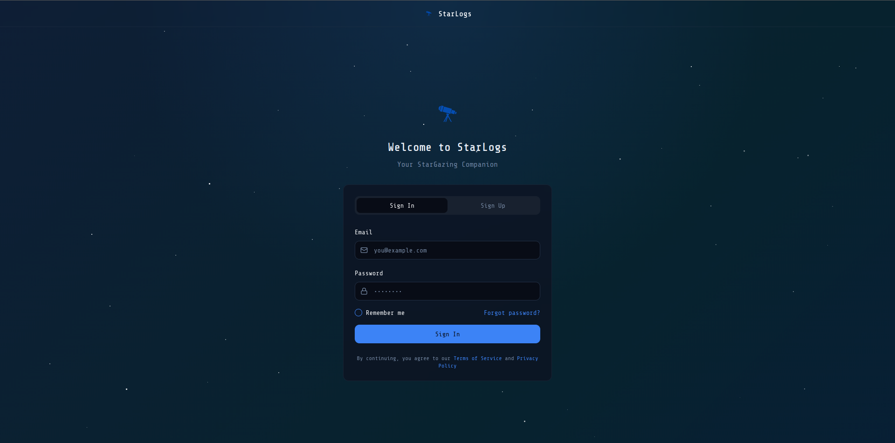
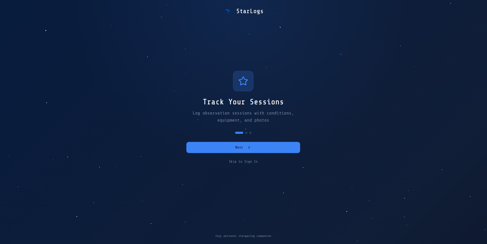
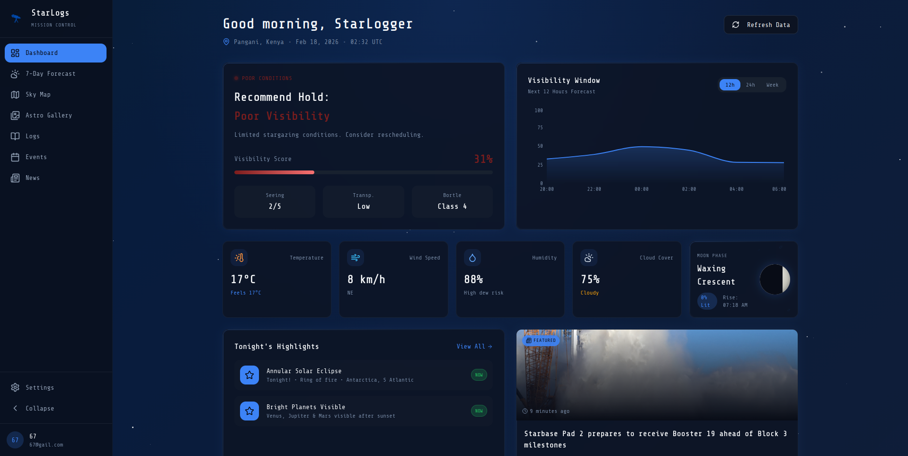
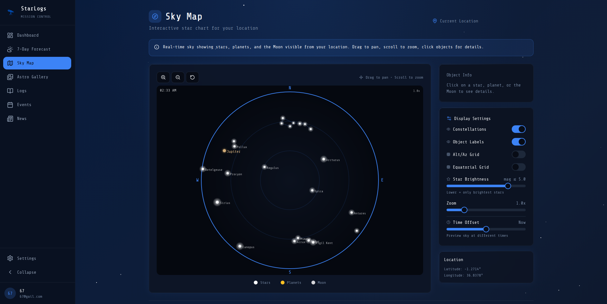
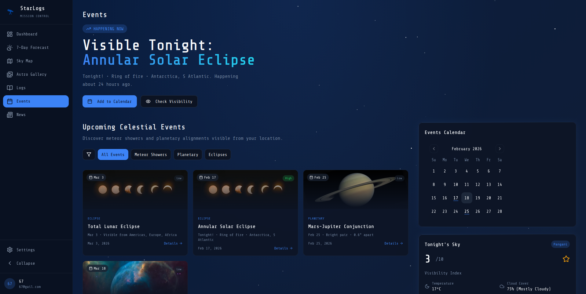
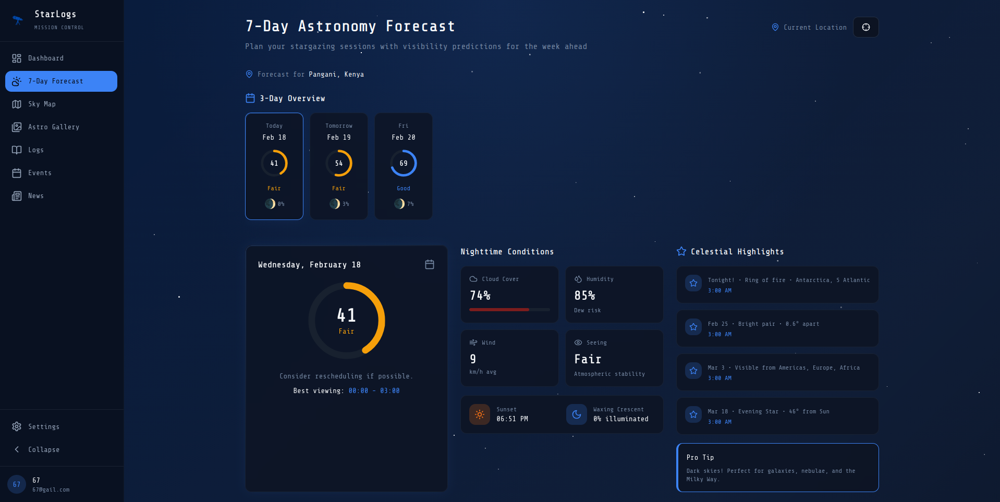
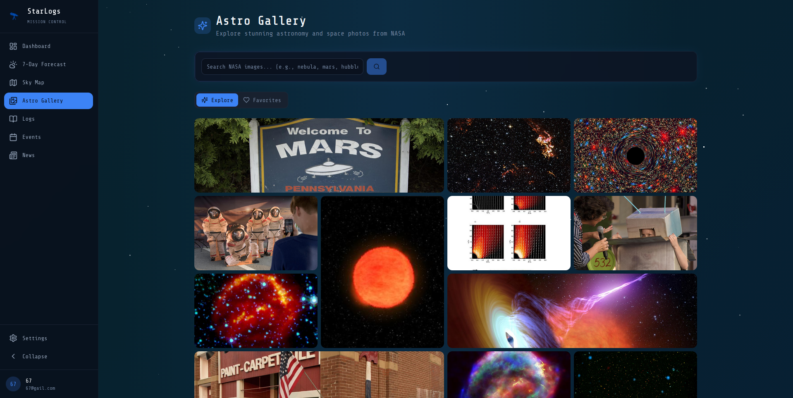
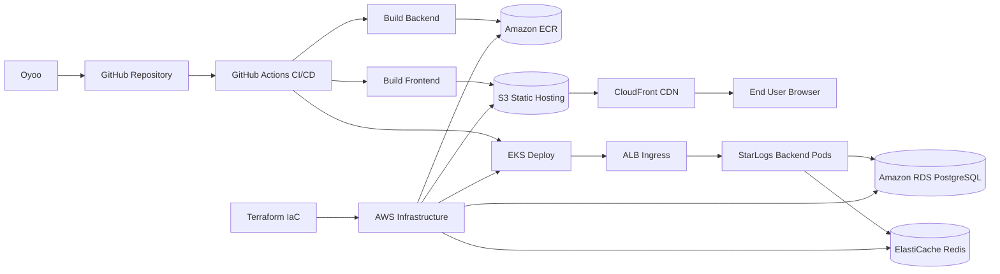

# StarLogs

StarLogs is an astronomy observation platform that lets users determine the best vissibility window for stargazing, I built it as a full-stack application and delivered for my DevOps portfolio.  
The focus is not only on application features, but on how software is packaged, validated, deployed, and operated in a cloud-native environment.

## Application Screenshots

<p align="center">
  
  
  
  
</p>
<p align="center">
  
  
  
  
</p>

## DevOps Workflow

Through this project I demonstrate a practical DevOps knowledge by demonstrating the delivery path from local development to AWS production infrastructure:

- Application services are containerized for consistent runtime behavior.
- Infrastructure is declared with Terraform for repeatable provisioning.
- Kubernetes manifests define runtime behavior for backend workloads on EKS.
- GitHub Actions orchestrates CI/CD for test, build, image publish, and deployment.
- Frontend is shipped as a static bundle to S3 and invalidated through CloudFront.

The repository is structured to show how my product code and operations code evolve together.

## DevOps Features Implemented

- Infrastructure as Code with Terraform for VPC, EKS, RDS, ElastiCache, ECR, and S3.
- Containerized frontend and backend services with Docker.
- Local multi-service environment using Docker Compose (frontend, backend, PostgreSQL, Redis).
- Kubernetes backend deployment with health probes and rolling update strategy.
- Horizontal Pod Autoscaler (HPA) for dynamic backend scaling.
- Ingress-based API exposure for EKS workloads.
- CI/CD pipeline using GitHub Actions for lint, build, image publish, and deployment.
- Frontend static deployment to S3 with CloudFront cache invalidation.
- API health endpoint for runtime health verification and orchestration readiness.

## Architecture Workflow Diagram



## CI/CD Workflow

1. A push or pull request to `main` triggers GitHub Actions.
2. Frontend and backend are linted and built.
3. Backend image is built and pushed to Amazon ECR.
4. Backend is rolled out to EKS.
5. Frontend static assets are deployed to S3.
6. CloudFront cache is invalidated to publish the latest UI.

## GitLab CI/CD Workflow

This repository now includes a GitLab pipeline in `.gitlab-ci.yml` with:
- Terraform formatting and validation checks.
- Frontend and backend quality gates (lint/build).
- Backend test job (configurable as strict once tests are added).
- Backend Docker build and publish to Amazon ECR.
- Frontend artifact build and deployment to S3.
- Backend deployment to EKS with Kubernetes manifest rendering via `envsubst`.
- Staging deploys from the default branch and manual production deploys from tags.
- Security scanning templates (SAST and secret detection).

Required GitLab CI/CD variables:
- `AWS_ACCESS_KEY_ID`
- `AWS_SECRET_ACCESS_KEY`
- `AWS_ACCOUNT_ID`
- `AWS_REGION` (optional if default used)
- `EKS_CLUSTER_NAME`
- `ECR_REPOSITORY`
- `FRONTEND_S3_BUCKET`
- `CLOUDFRONT_DISTRIBUTION_ID` (optional)
- `K8S_NAMESPACE` (optional if default used)

## Tech Stack

### Application
- Frontend: React, TypeScript, Vite, Tailwind CSS
- Backend: Express, TypeScript, Prisma
- Data: PostgreSQL, Redis

### DevOps
- Containers: Docker, Docker Compose
- Orchestration: Kubernetes (EKS)
- Infrastructure as Code: Terraform
- CI/CD: GitHub Actions
- Cloud: AWS (EKS, ECR, RDS, ElastiCache, S3, CloudFront)

## Repository Layout

```text
.
├── src/                        # Frontend application
├── backend/                    # Backend API service
├── infrastructure/
│   ├── terraform/              # AWS infrastructure definitions
│   └── kubernetes/             # Kubernetes manifests
├── docker-compose.yml          # Local multi-service environment
└── .github/workflows/          # CI/CD pipelines
```

## Local Development

Prerequisites:
- Node.js 20+
- npm
- Docker (optional but recommended for full local stack)

Frontend quick start:

```sh
npm install
npm run dev
```

Backend quick start:

```sh
cd backend
npm install
npm run prisma:generate
npm run dev
```

Full local stack with Docker:

```sh
docker-compose up -d
```

## Infrastructure and Deployment

- Terraform setup and provisioning details: `infrastructure/README.md`
- Kubernetes deployment manifests: `infrastructure/kubernetes/`
- Backend service details: `backend/README.md`

## Portfolio Scope

This portfolio emphasizes:
- Reproducible infrastructure
- Automated delivery
- Service scalability (HPA)
- Operational readiness through health checks and rolling deployment patterns
